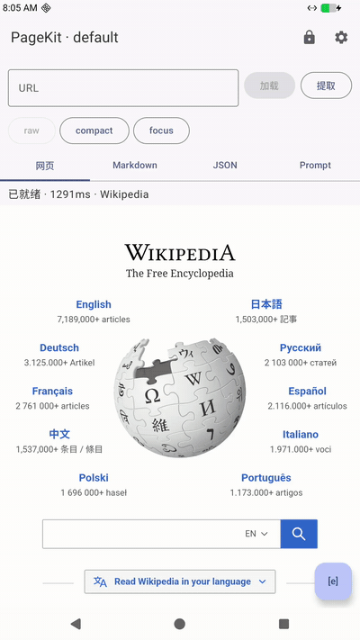

<p align="center">
  
</p>

<h1 align="center">PageKit</h1>

<p align="center">
  Free Web Search, Web Fetch &amp; Browser Automation<br>
  for AI Agents — powered by spare Android devices.
</p>

<p align="center">
  <a href="https://github.com/Ken-u/PageKit/actions/workflows/android.yml"></a>
  
  
  
  <a href="https://github.com/Ken-u/PageKit/releases"></a>
</p>

<p align="center"><b>No API Key · No Quota · No Subscription</b></p>

<p align="center">
  <a href="README.md">English</a> · <a href="README.zh-CN.md">简体中文</a>
</p>

<p align="center">
  
</p>

Turn an old Android phone, tablet, TV box or development board into a dedicated web runtime for Claude Code, Kimi Code, Cursor, Cline and local LLMs. PageKit runs an MCP server on the device and drives a real Android WebView: the device opens pages, blocks ads, extracts clean structured content and returns it to your agent over standard MCP. Multi-session concurrency, browser automation, and a screensaver for idle OLED burn-in protection are built in.

<p align="center"><b>↓</b></p>

```bash
curl -O https://raw.githubusercontent.com/Ken-u/PageKit/main/deploy.sh && chmod +x deploy.sh
./deploy.sh setup   # download APK → install → launch → print connection info
```

## How it compares

| | SearXNG | Paid search APIs (Tavily/Serper…) | Server-side headless browser | **PageKit** |
|---|---|---|---|---|
| Search | ✓ | ✓ | ✗ | ✓ |
| Fetch page content | result links only | partial | ✓ | ✓ |
| JS rendering | ✗ | partial | ✓ | ✓ |
| Browser interaction | ✗ | ✗ | ✓ | ✓ |
| Anti-bot survivability | poor (datacenter IP) | vendor-dependent | poor (datacenter IP) | good (real phone, indistinguishable from a human) |
| Login state / cookies | ✗ | ✗ | single | multi-profile isolation |
| Ad blocking | ✗ | ✗ | DIY | built in |
| Running cost | a server | pay per call | a server | one spare phone/tablet |

In short: search, fetch and interaction all work, and the only cost is a device that's sitting in a drawer. A real-device WebView means JS rendering, dynamic loading and bot detection are non-issues; profiles isolate cookies so login states persist per session. No fees, no quotas, no external service dependencies.

### Anti-bot & freshness, tested on real hardware

Measured on a commodity rk3588 board:

| Site | Detection type | Result |
|------|----------|------|
| bot.sannysoft.com | fingerprinting | ✓ passed — WebDriver missing, WebGL reports the real GPU, no headless markers |
| amazon.com | heavy anti-bot e-commerce | ✓ full product page, no CAPTCHA |
| nowsecure.nl | Cloudflare | ✓ got the content |
| time.is | freshness | ✓ page time matched local clock to the second |
| reddit.com | login required | ✗ blocked by network security (expected — needs a logged-in profile) |
| medium.com | CF interactive challenge | ✗ stuck at "Just a moment" |

Two takeaways:

- **Real-device anti-bot capability is genuine**: the fingerprint checker goes all green (headless Chrome fails the WebDriver test there), and Amazon plus Cloudflare passive protection both pass. Strong interactive challenges and login-walled sites don't pass — that's the boundary for any no-login solution; use a logged-in profile for those.
- **Every call renders live**: there is no cache layer. The WebView opens the page and extracts content on the spot. Fetching time.is returns the current time. Search returns what the engine returns right now, not a periodic snapshot — many search APIs serve caches that are days old.

Compared to server-side headless browsers, the edge isn't raw speed but **success rate and freshness**: real-device fingerprint, no headless markers, live rendering, no queue, no cache.

## What you get

- **Web fetch** — renders the full page in WebView, then extracts the article body; dynamic JS content included
- **Ad blocking** — built-in hosts rules + element-hiding rules; ad domains and popups are gone by default
- **Content compression** — optional OpenAI-compatible LLM summarizes long pages to save tokens
- **Concurrent sessions** — profiles isolate cookies/caches/processes; fetch multiple pages in parallel without interference
- **Browser interaction** — click, type, scroll, select dropdowns, like a human
- **Idle screensaver** — full-screen overlay after an idle timeout to prevent OLED burn-in; timeout configurable, manual trigger available
- **WebView proxy** — routes only the WebView network stack; never touches the system-wide proxy

## Quick start

### Deploy (no build toolchain needed)

Grab the APK from the releases page and let `deploy.sh` do the work — the only host-side requirement is adb:

```bash
curl -O https://raw.githubusercontent.com/Ken-u/PageKit/main/deploy.sh && chmod +x deploy.sh

./deploy.sh setup            # download APK → install → launch → print connection info
```

More `deploy.sh` commands:

| Command | What it does |
|------|------|
| `setup` | one shot: download/install APK → launch → print connection info (incl. a ready-to-paste Claude Code command) |
| `install [apk]` | install an APK (defaults to the latest GitHub release) |
| `run` | launch the app → print connection info |
| `token` | print the device's MCP token and endpoint |
| `set-token <token>` | set the token (restore after reflash/device swap; client configs stay valid) |
| `load` | push settings from `.env` to the device (token/proxy/screensaver/concurrency) |
| `forward` | adb port forwarding (3000/3001 → localhost) |

Multiple devices: `PAGEKIT_DEVICE=<serial>`. Already have an APK: `PAGEKIT_APK=<path>` skips the download.

### Build from source

```bash
./build.sh release           # build a signed release APK
./build.sh install [serial]  # build and install to a device
```

First build needs JDK 17+ and the Android SDK; set `sdk.dir` in `local.properties`.

### Configuration

Copy `.env.example` to `.env`, fill in token and proxy, then push:

```bash
cp .env.example .env
# edit .env: token, proxy address, ...
./deploy.sh load   # or ./build.sh load [serial]
```

`.env` is git-ignored. Supported variables:

| Variable | Description |
|------|------|
| `PAGEKIT_TOKEN` | MCP auth token; survives reinstalls |
| `PAGEKIT_PROXY_ENABLED` | enable the WebView proxy |
| `PAGEKIT_PROXY_HOST` | proxy host |
| `PAGEKIT_PROXY_PORT` | proxy port |
| `PAGEKIT_PROXY_BYPASS` | domains that bypass the proxy (semicolon-separated) |
| `PAGEKIT_SCREENSAVER_TIMEOUT_MS` | idle timeout before the screensaver kicks in |
| `PAGEKIT_MAX_SESSIONS` | max concurrent sessions |

Everything can also be changed in the app's settings screen.

### Connect

Once the device is set up, agents reach it one of two ways:

**LAN direct (recommended — device and agent on the same network):**

```bash
# the device IP is shown on the app's main screen, e.g. 192.168.1.100
http://192.168.1.100:3000/mcp
```

**adb port forwarding (device elsewhere / don't want to expose ports):**

```bash
adb forward tcp:3000 tcp:3000  # usage endpoint (webfetch/websearch/browser_*/files)
adb forward tcp:3001 tcp:3001  # admin endpoint (profile/session/proxy/llm management)
# then use http://localhost:3000/mcp
```

`./build.sh run [serial] [url]` chains build → install → launch → forward → print connection info.

### Fetching downloaded files

After `file_download` stores a file on the device, the result includes a `download_url`
(e.g. `/files/p0_default_s0_xxx/report.xlsx`). Fetch the file body with the same Bearer
token as MCP:

```bash
curl -H "Authorization: Bearer $PAGEKIT_TOKEN" \
  -o report.xlsx "http://localhost:3000/files/p0_default_s0_xxx/report.xlsx"
```

## Hook it up to your agent

Two interfaces, covering the mainstream options:

| Interface | Endpoint | For |
|------|------|------|
| MCP (streamable HTTP) | `http://<device>:3000/mcp` | Claude Code / Cursor / Windsurf and any MCP-capable client |
| HTTP API | `POST /v1/search`, `POST /v1/fetch` | homegrown agents, scripts, anything that can send HTTP |

Auth is `Authorization: Bearer <token>`; find the token on the app's main screen or via `./build.sh token`.

### Claude Code / Claude Desktop

```bash
claude mcp add --transport http pagekit http://<device-ip>:3000/mcp \
  --header "Authorization: Bearer <token>"
```

Or edit the config file (`~/.claude.json`) directly:

```json
{
  "mcpServers": {
    "pagekit": {
      "type": "http",
      "url": "http://192.168.1.100:3000/mcp",
      "headers": { "Authorization": "Bearer <token>" }
    }
  }
}
```

Once connected the agent gets `webfetch` / `websearch` / `browser_*`.

### Cursor / Windsurf

Add an MCP server (Cursor: Settings → MCP → Add Server; Windsurf: plugin settings → MCP Servers):

```json
{
  "mcpServers": {
    "pagekit": {
      "serverUrl": "http://192.168.1.100:3000/mcp",
      "headers": { "Authorization": "Bearer <token>" }
    }
  }
}
```

### Any MCP-capable client

The MCP endpoint is a standard streamable HTTP implementation. Any conforming client (Cline, Zed, OpenCode, goose, …) just needs the URL plus the Bearer token — no special adapters.

### HTTP API (homegrown agents / scripts)

Skip MCP and call HTTP directly:

```bash
# search (Kimi SearchWeb-compatible payload)
curl -X POST http://192.168.1.100:3000/v1/search \
  -H "Authorization: Bearer <token>" \
  -H "Content-Type: application/json" \
  -d '{"text_query": "android mcp server"}'

# fetch (returns the extracted markdown body)
curl -X POST http://192.168.1.100:3000/v1/fetch \
  -H "Authorization: Bearer <token>" \
  -H "Content-Type: application/json" \
  -d '{"url": "https://example.com"}'
```

`/v1/search` is a drop-in compatible endpoint for Kimi's native SearchWeb — point the SearchWeb provider at it and you're done. Both endpoints accept optional `X-PageKit-Session` / `X-PageKit-Profile` headers; omit them and a session is assigned automatically and rendered live on the device UI.

## MCP tools

Two groups of MCP tools, on ports 3000 and 3001:

**Usage (3000) — what agents call:**

| Tool | Description |
|------|------|
| `webfetch` | fetch a page; returns de-adsed structured content |
| `websearch` | search engine query; returns the result list |
| `expand` | expand one section of a page (long content in chunks) |
| `browser_navigate` | navigate to a URL |
| `browser_snapshot` | snapshot of the page's interactive elements |
| `browser_click` | click an element |
| `browser_type` | type into an input |
| `browser_scroll` | scroll the page |
| `browser_select` | pick a dropdown option |
| `browser_back` | go back |
| `browser_url` | get the current URL |
| `file_download` | Download a file over HTTP(S) with the session's cookies (logged-in exports work; 100 MiB per-file limit). Omit `url` to execute the most recent browser-triggered download. The result includes `download_url` to fetch the file via `GET /files/...` |
| `file_list` | List files in the session's download directory (with `download_url`) |
| `file_delete` | Delete one downloaded file |

**Admin (3001) — for management agents:**

| Tool | Description |
|------|------|
| `profile_create` / `profile_delete` / `profile_list` | profile management |
| `session_create` / `session_close` / `session_close_idle` / `session_list` | session management |
| `proxy_configure` / `proxy_status` | proxy configuration |
| `llm_configure` / `llm_status` | LLM compressor configuration |

Omitting `session_id` assigns a concurrent session that shows up live in the UI; passing it pins the call to that session.

## Architecture

```
┌─────────────────────────────────────────────┐
│                PageKit App                   │
│  ┌───────────┐  ┌────────────────────────┐  │
│  │  main      │  │  profile workers      │  │
│  │  process   │  │  (:profile1/2/3)      │  │
│  │            │  │                        │  │
│  │  WebView   │  │  WebView (own cookies) │  │
│  │  MCP server│  │  own data-dir          │  │
│  │  UI/saver  │  │                        │  │
│  └─────┬─────┘  └───────────┬────────────┘  │
│        │    AIDL/binder      │              │
│        └──────────┬──────────┘              │
│                   │                         │
│         ┌─────────┴─────────┐               │
│         │  AdBlocker        │               │
│         │  ContentExtractor │               │
│         │  LLM Compressor   │               │
│         └───────────────────┘               │
└─────────────────────────────────────────────┘
         │ port 3000 (usage)
         │ port 3001 (admin)
    MCP / HTTP / SSE
         │
    AI Agent (Claude / GPT / ...)
```

- **Multi-process isolation**: each profile runs in its own process; WebView data directories, cookies and caches are fully isolated
- **Ad blocking**: hosts-based request blocking + CSS element hiding; rules auto-update
- **Content extraction**: Readability.js with a semantic-tags fallback; sandboxed pages (raw text) fall back to native HTTP
- **Stable token**: persisted at first launch; survives restarts until manually reset

## build.sh reference

| Command | Description |
|------|------|
| `build` | build a debug APK |
| `release` | build a signed release APK |
| `install [serial]` | build and install |
| `run [serial] [url]` | build → install → launch → forward → print info |
| `load [serial]` | push `.env` settings to the device |
| `token [serial]` | print the device's MCP token |
| `set-token <token> [serial]` | set the device's MCP token |
| `test` | run unit tests |
| `verify [serial]` | end-to-end verification |
| `mcptest [serial]` | MCP protocol tests |
| `sessiontest [serial]` | concurrent-session tests |
| `clean` | clean build artifacts |

## Tech stack

- Kotlin + Jetpack Compose
- AndroidX WebKit (ProxyController proxying)
- Ktor server (MCP over HTTP/SSE)
- Readability.js (content extraction)
- AIDL multi-process IPC

## License

Apache-2.0
